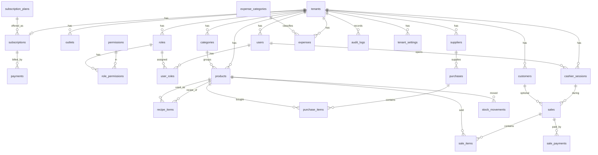
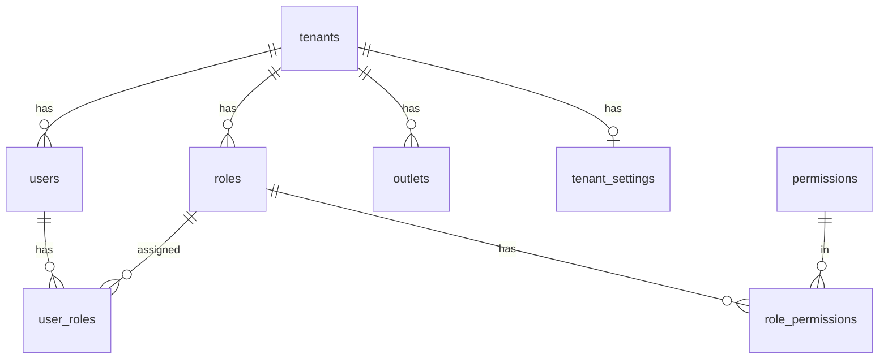
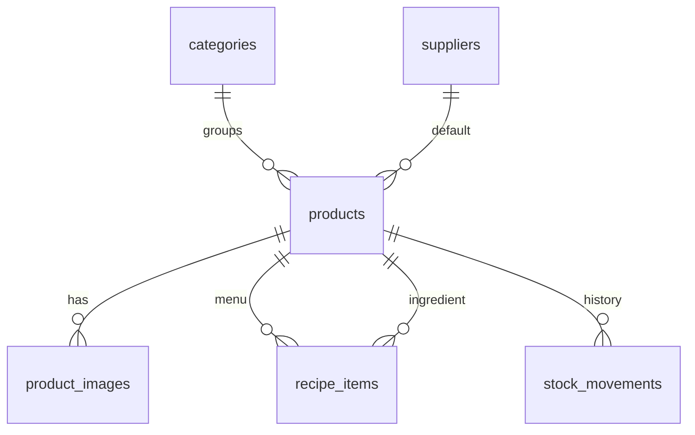
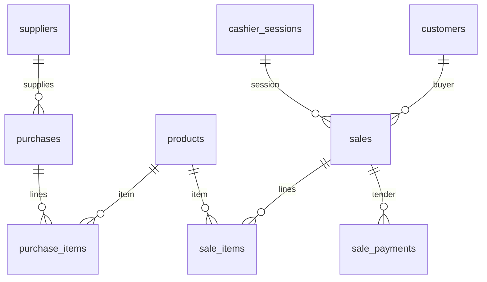
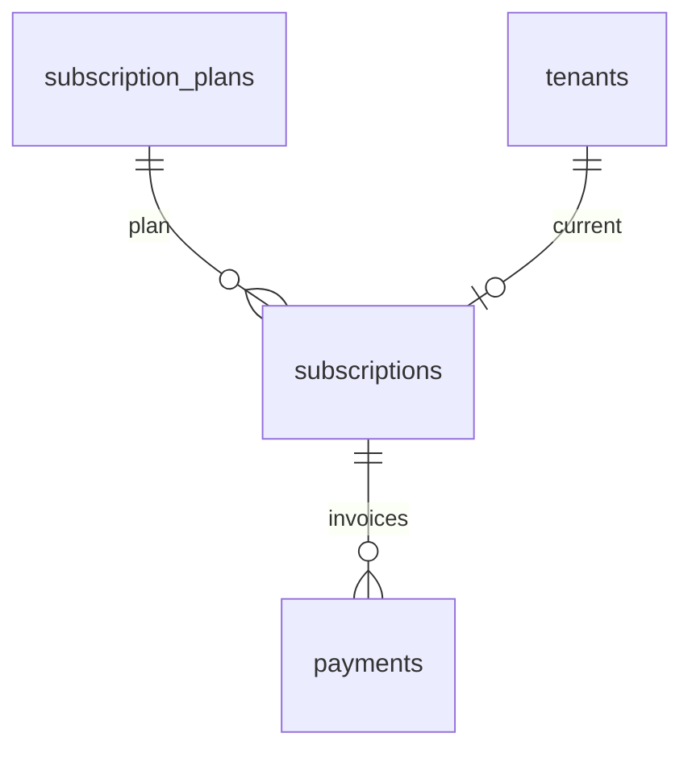

# Lampiran ERD dan Kamus Data — Kranjang

**Versi:** 1.1  
**Database:** Supabase PostgreSQL  
**ORM:** Prisma  
**PK:** UUID (`gen_random_uuid()`)  
**Uang:** `DECIMAL(19,2)`  
**Kuantitas:** `DECIMAL(18,4)`  
**Waktu:** `TIMESTAMPTZ`, tampilan `Asia/Jakarta`

Dokumen utama: [Kranjang-prd.md](./Kranjang-prd.md)

---

## 1. Konvensi

- Setiap tabel bisnis punya `tenant_id` (kecuali `permissions` global dan `subscription_plans` global, serta user Super Admin).
- Soft delete: `deleted_at TIMESTAMPTZ NULL` pada master data.
- Index tenant selalu leading: `(tenant_id, ...)`.
- Unique bisnis selalu **per tenant**, bukan global.
- Nama tabel: snake_case plural.

---

## 2. ERD keseluruhan



---

## 3. ERD per aggregat

### 3.1 Identitas dan akses



### 3.2 Produk, resep, stok



### 3.3 Pembelian dan penjualan



### 3.4 Billing SaaS



---

## 4. Kamus tabel

Notasi: **PK**, FK, UQ = unique, IDX = index. `tenant_id` selalu FK ke `tenants.id` kecuali disebut lain.

### 4.1 tenants

| Kolom | Tipe | Ket |
| --- | --- | --- |
| id | UUID PK | |
| name | VARCHAR(120) | Nama usaha |
| slug | VARCHAR(80) UQ | URL internal |
| phone | VARCHAR(20) NULL | |
| email | VARCHAR(255) NULL | |
| trial_start_date | TIMESTAMPTZ | |
| trial_end_date | TIMESTAMPTZ | +30 hari saat create |
| subscription_status | VARCHAR(20) | TRIAL/ACTIVE/GRACE_PERIOD/EXPIRED/SUSPENDED/CANCELLED |
| subscription_plan_id | UUID NULL FK | |
| payment_status | VARCHAR(20) | NONE/PENDING/PAID/FAILED/EXPIRED |
| allow_negative_stock | BOOLEAN | default false |
| timezone | VARCHAR(40) | default Asia/Jakarta |
| created_at | TIMESTAMPTZ | |
| updated_at | TIMESTAMPTZ | |
| deleted_at | TIMESTAMPTZ NULL | |

IDX: `subscription_status`, `trial_end_date`

### 4.2 tenant_settings

| Kolom | Tipe | Ket |
| --- | --- | --- |
| id | UUID PK | |
| tenant_id | UUID UQ | 1 baris per tenant |
| tax_percent | DECIMAL(5,2) | default 0 |
| tax_inclusive | BOOLEAN | default true di revenue |
| receipt_footer | TEXT NULL | |
| created_at / updated_at | TIMESTAMPTZ | |

### 4.3 users

| Kolom | Tipe | Ket |
| --- | --- | --- |
| id | UUID PK | |
| tenant_id | UUID NULL | NULL hanya Super Admin platform |
| name | VARCHAR(120) | |
| email | VARCHAR(255) UQ global | login |
| password_hash | VARCHAR(255) | |
| phone | VARCHAR(20) NULL | |
| is_super_admin | BOOLEAN | default false |
| email_verified_at | TIMESTAMPTZ NULL | |
| last_login_at | TIMESTAMPTZ NULL | |
| created_at / updated_at / deleted_at | TIMESTAMPTZ | |

IDX: `(tenant_id, email)`  
Karyawan = user. Tidak ada tabel `employees`.

### 4.4 roles

| Kolom | Tipe | Ket |
| --- | --- | --- |
| id | UUID PK | |
| tenant_id | UUID NULL | NULL = role template sistem yang di-copy ke tenant baru |
| name | VARCHAR(50) | Owner, Administrator, Manager, Cashier, Inventory Staff |
| is_system | BOOLEAN | tidak boleh hapus |
| created_at / updated_at | TIMESTAMPTZ | |

UQ: `(tenant_id, name)`

### 4.5 permissions

| Kolom | Tipe | Ket |
| --- | --- | --- |
| id | UUID PK | |
| code | VARCHAR(80) UQ | product.view, sales.create, ... |
| module | VARCHAR(40) | |
| description | VARCHAR(255) | |

Global, tanpa tenant_id.

### 4.6 role_permissions

PK `(role_id, permission_id)`  
FK role_id, permission_id

### 4.7 user_roles

PK `(user_id, role_id)`  
MVP: 1 role aktif per user; tabel tetap many-to-many.

### 4.8 outlets

| Kolom | Tipe | Ket |
| --- | --- | --- |
| id | UUID PK | |
| tenant_id | UUID | |
| name | VARCHAR(120) | default "Outlet Utama" |
| address | TEXT NULL | |
| is_default | BOOLEAN | |
| created_at / updated_at / deleted_at | TIMESTAMPTZ | |

UQ: `(tenant_id, name)`  
MVP UI: 1 outlet. Seed otomatis saat register.

### 4.9 subscription_plans

| Kolom | Tipe | Ket |
| --- | --- | --- |
| id | UUID PK | |
| code | VARCHAR(40) UQ | trial, basic, business, pro |
| name | VARCHAR(80) | |
| price_monthly | DECIMAL(19,2) | |
| price_yearly | DECIMAL(19,2) NULL | |
| duration_days | INT | trial = 30 |
| max_users | INT NULL | null = unlimited |
| max_products | INT NULL | |
| max_transactions_monthly | INT NULL | |
| max_outlets | INT | MVP 1 |
| max_storage_mb | INT NULL | |
| feature_reports | BOOLEAN | |
| feature_inventory | BOOLEAN | |
| feature_multi_outlet | BOOLEAN | |
| feature_export | BOOLEAN | |
| is_active | BOOLEAN | |
| created_at / updated_at | TIMESTAMPTZ | |

Tanpa tenant_id. Dikelola Super Admin.

### 4.10 subscriptions

| Kolom | Tipe | Ket |
| --- | --- | --- |
| id | UUID PK | |
| tenant_id | UUID | |
| plan_id | UUID FK | |
| status | VARCHAR(20) | mirror tenant.subscription_status |
| billing_cycle | VARCHAR(20) | MONTHLY / YEARLY / TRIAL |
| current_period_start | TIMESTAMPTZ | |
| current_period_end | TIMESTAMPTZ | |
| grace_period_end | TIMESTAMPTZ NULL | |
| cancel_at_period_end | BOOLEAN | |
| pending_plan_id | UUID NULL | downgrade terjadwal |
| created_at / updated_at | TIMESTAMPTZ | |

IDX: `(tenant_id, status)`, `current_period_end`  
Satu subscription aktif per tenant (partial unique index `tenant_id` WHERE status IN ('TRIAL','ACTIVE','GRACE_PERIOD')).

### 4.11 payments

Pembayaran **langganan SaaS**, bukan tender kasir.

| Kolom | Tipe | Ket |
| --- | --- | --- |
| id | UUID PK | |
| tenant_id | UUID | |
| subscription_id | UUID FK | |
| order_id | VARCHAR(64) UQ | idempotency Midtrans |
| transaction_id | VARCHAR(64) NULL | |
| amount | DECIMAL(19,2) | |
| payment_method | VARCHAR(40) NULL | |
| status | VARCHAR(20) | PENDING/PAID/FAILED/EXPIRED/CANCELLED |
| paid_at | TIMESTAMPTZ NULL | |
| expired_at | TIMESTAMPTZ NULL | |
| raw_response | JSONB NULL | tanpa data kartu |
| created_at / updated_at | TIMESTAMPTZ | |

IDX: `(tenant_id, created_at DESC)`, `status`

### 4.12 categories

| Kolom | Tipe | Ket |
| --- | --- | --- |
| id | UUID PK | |
| tenant_id | UUID | |
| name | VARCHAR(80) | |
| sort_order | INT | default 0 |
| created_at / updated_at / deleted_at | TIMESTAMPTZ | |

UQ: `(tenant_id, name)` WHERE deleted_at IS NULL

### 4.13 products

| Kolom | Tipe | Ket |
| --- | --- | --- |
| id | UUID PK | |
| tenant_id | UUID | |
| outlet_id | UUID FK | MVP selalu outlet default |
| category_id | UUID NULL FK | |
| supplier_id | UUID NULL FK | default supplier |
| sku | VARCHAR(40) NULL | |
| barcode | VARCHAR(64) NULL | |
| name | VARCHAR(160) | |
| unit | VARCHAR(20) | kg, g, pcs, porsi, liter |
| product_type | VARCHAR(20) | SIMPLE / RECIPE / INGREDIENT |
| buy_price | DECIMAL(19,2) | harga beli terakhir (informasi) |
| sell_price | DECIMAL(19,2) | 0 untuk INGREDIENT |
| avg_cost | DECIMAL(19,4) | moving average |
| stock | DECIMAL(18,4) | 0 dan tidak dipakai untuk RECIPE |
| min_stock | DECIMAL(18,4) | default 0 |
| is_active | BOOLEAN | |
| created_at / updated_at / deleted_at | TIMESTAMPTZ | |

UQ: `(tenant_id, sku)` WHERE sku IS NOT NULL AND deleted_at IS NULL  
UQ: `(tenant_id, barcode)` WHERE barcode IS NOT NULL AND deleted_at IS NULL  
IDX: `(tenant_id, name)`, `(tenant_id, product_type, is_active)`, `(tenant_id, barcode)`

### 4.14 product_images

| Kolom | Tipe | Ket |
| --- | --- | --- |
| id | UUID PK | |
| tenant_id | UUID | |
| product_id | UUID FK | |
| storage_path | VARCHAR(255) | path Supabase Storage |
| created_at | TIMESTAMPTZ | |

### 4.15 recipe_items

BOM. Header terpisah tidak diperlukan di MVP; item menempel ke produk RECIPE.

| Kolom | Tipe | Ket |
| --- | --- | --- |
| id | UUID PK | |
| tenant_id | UUID | |
| product_id | UUID FK | menu RECIPE |
| ingredient_id | UUID FK | INGREDIENT atau SIMPLE |
| quantity | DECIMAL(18,4) | per 1 porsi menu |
| unit | VARCHAR(20) | = unit stok bahan |
| created_at / updated_at | TIMESTAMPTZ | |

UQ: `(product_id, ingredient_id)`  
CHECK: `product_id <> ingredient_id`  
CHECK: `quantity > 0`

### 4.16 suppliers

| Kolom | Tipe | Ket |
| --- | --- | --- |
| id | UUID PK | |
| tenant_id | UUID | |
| name | VARCHAR(120) | |
| phone | VARCHAR(20) NULL | |
| address | TEXT NULL | |
| created_at / updated_at / deleted_at | TIMESTAMPTZ | |

UQ: `(tenant_id, name)` WHERE deleted_at IS NULL

### 4.17 purchases

| Kolom | Tipe | Ket |
| --- | --- | --- |
| id | UUID PK | |
| tenant_id | UUID | |
| outlet_id | UUID FK | |
| supplier_id | UUID FK | |
| invoice_no | VARCHAR(60) | |
| purchased_at | DATE | |
| discount_amount | DECIMAL(19,2) | default 0 |
| tax_amount | DECIMAL(19,2) | default 0 |
| total_amount | DECIMAL(19,2) | |
| document_status | VARCHAR(20) | DRAFT / RECEIVED / CANCELLED |
| payment_status | VARCHAR(20) | UNPAID / PARTIAL / PAID |
| notes | TEXT NULL | |
| created_by | UUID FK users | |
| received_at | TIMESTAMPTZ NULL | |
| created_at / updated_at | TIMESTAMPTZ | |

UQ: `(tenant_id, invoice_no)`  
IDX: `(tenant_id, purchased_at DESC)`

### 4.18 purchase_items

| Kolom | Tipe | Ket |
| --- | --- | --- |
| id | UUID PK | |
| tenant_id | UUID | |
| purchase_id | UUID FK | ON DELETE CASCADE |
| product_id | UUID FK | INGREDIENT atau SIMPLE |
| quantity | DECIMAL(18,4) | |
| unit_cost | DECIMAL(19,2) | |
| line_total | DECIMAL(19,2) | |

### 4.19 customers

| Kolom | Tipe | Ket |
| --- | --- | --- |
| id | UUID PK | |
| tenant_id | UUID | |
| name | VARCHAR(120) | |
| phone | VARCHAR(20) NULL | |
| created_at / updated_at / deleted_at | TIMESTAMPTZ | |

IDX: `(tenant_id, name)`, `(tenant_id, phone)`

### 4.20 cashier_sessions

| Kolom | Tipe | Ket |
| --- | --- | --- |
| id | UUID PK | |
| tenant_id | UUID | |
| outlet_id | UUID FK | |
| opened_by | UUID FK users | |
| closed_by | UUID NULL FK | |
| opening_cash | DECIMAL(19,2) | default 0 |
| closing_cash | DECIMAL(19,2) NULL | |
| opened_at | TIMESTAMPTZ | |
| closed_at | TIMESTAMPTZ NULL | |
| status | VARCHAR(20) | OPEN / CLOSED |

Partial UQ: satu sesi OPEN per `(tenant_id, outlet_id, opened_by)` — atau satu OPEN per outlet di MVP.

### 4.21 sales

| Kolom | Tipe | Ket |
| --- | --- | --- |
| id | UUID PK | |
| tenant_id | UUID | |
| outlet_id | UUID FK | |
| cashier_session_id | UUID FK | |
| cashier_id | UUID FK users | |
| customer_id | UUID NULL FK | |
| receipt_no | VARCHAR(40) | |
| sold_at | TIMESTAMPTZ | |
| subtotal | DECIMAL(19,2) | sebelum diskon header |
| discount_amount | DECIMAL(19,2) | |
| tax_amount | DECIMAL(19,2) | |
| total_net | DECIMAL(19,2) | revenue |
| status | VARCHAR(20) | COMPLETED / CANCELLED |
| cancelled_at | TIMESTAMPTZ NULL | |
| cancelled_by | UUID NULL | |
| notes | TEXT NULL | |
| created_at / updated_at | TIMESTAMPTZ | |

UQ: `(tenant_id, receipt_no)`  
IDX: `(tenant_id, sold_at DESC)`, `(tenant_id, status, sold_at)`

### 4.22 sale_items

| Kolom | Tipe | Ket |
| --- | --- | --- |
| id | UUID PK | |
| tenant_id | UUID | |
| sale_id | UUID FK | ON DELETE RESTRICT |
| product_id | UUID FK | |
| product_name_snapshot | VARCHAR(160) | |
| quantity | DECIMAL(18,4) | |
| unit_price | DECIMAL(19,2) | |
| discount_amount | DECIMAL(19,2) | |
| line_total | DECIMAL(19,2) | |
| cogs_amount | DECIMAL(19,2) | snapshot HPP |
| recipe_snapshot | JSONB NULL | BOM + cost bahan saat jual |

`recipe_snapshot` mencegah HPP berubah jika resep diubah nanti. Laporan profitabilitas memakai `cogs_amount`, bukan hitung ulang.

### 4.23 sale_payments

Tender kasir (bukan tabel `payments` langganan).

| Kolom | Tipe | Ket |
| --- | --- | --- |
| id | UUID PK | |
| tenant_id | UUID | |
| sale_id | UUID FK | |
| method | VARCHAR(20) | CASH / QRIS / TRANSFER / EWALLET / CARD |
| amount | DECIMAL(19,2) | |
| created_at | TIMESTAMPTZ | |

MVP: 1 baris per sale. Split payment = banyak baris, ditunda.

### 4.24 expense_categories

| Kolom | Tipe | Ket |
| --- | --- | --- |
| id | UUID PK | |
| tenant_id | UUID | |
| name | VARCHAR(80) | listrik, air, ... |
| is_system | BOOLEAN | |
| created_at / updated_at | TIMESTAMPTZ | |

UQ: `(tenant_id, name)`  
Seed per tenant baru.

### 4.25 expenses

| Kolom | Tipe | Ket |
| --- | --- | --- |
| id | UUID PK | |
| tenant_id | UUID | |
| outlet_id | UUID FK | |
| category_id | UUID FK | |
| description | VARCHAR(255) | |
| amount | DECIMAL(19,2) | |
| expense_date | DATE | |
| payment_method | VARCHAR(20) | |
| attachment_path | VARCHAR(255) NULL | Supabase Storage |
| created_by | UUID FK | |
| created_at / updated_at / deleted_at | TIMESTAMPTZ | |

IDX: `(tenant_id, expense_date DESC)`

### 4.26 stock_movements

| Kolom | Tipe | Ket |
| --- | --- | --- |
| id | UUID PK | |
| tenant_id | UUID | |
| outlet_id | UUID FK | |
| product_id | UUID FK | |
| movement_type | VARCHAR(30) | PURCHASE / SALE / ADJUSTMENT / INITIAL_STOCK / WASTE |
| quantity | DECIMAL(18,4) | bertanda: + masuk, − keluar |
| stock_before | DECIMAL(18,4) | |
| stock_after | DECIMAL(18,4) | |
| unit_cost | DECIMAL(19,4) NULL | cost saat movement |
| reference_type | VARCHAR(30) NULL | purchase / sale / adjustment |
| reference_id | UUID NULL | |
| notes | TEXT NULL | |
| created_by | UUID FK | |
| created_at | TIMESTAMPTZ | |

IDX: `(tenant_id, product_id, created_at DESC)`, `(tenant_id, reference_type, reference_id)`  
Tidak di-update; append-only.

### 4.27 audit_logs

| Kolom | Tipe | Ket |
| --- | --- | --- |
| id | UUID PK | |
| tenant_id | UUID NULL | null untuk aksi Super Admin |
| user_id | UUID NULL | |
| action | VARCHAR(40) | LOGIN, CREATE, UPDATE, DELETE, ADJUST, CANCEL, PAYMENT |
| module | VARCHAR(40) | |
| entity | VARCHAR(40) | |
| entity_id | UUID NULL | |
| old_value | JSONB NULL | |
| new_value | JSONB NULL | |
| ip_address | VARCHAR(45) NULL | |
| user_agent | VARCHAR(255) NULL | |
| created_at | TIMESTAMPTZ | |

IDX: `(tenant_id, created_at DESC)`, `(tenant_id, entity, entity_id)`  
Append-only.

### 4.28 password_reset_tokens / email_verification_tokens

| Kolom | Tipe | Ket |
| --- | --- | --- |
| id | UUID PK | |
| user_id | UUID FK | |
| token_hash | VARCHAR(255) | |
| expires_at | TIMESTAMPTZ | |
| used_at | TIMESTAMPTZ NULL | |
| created_at | TIMESTAMPTZ | |

IDX: `token_hash`

---

## 5. Relasi dan aturan hapus

| Parent | Child | On delete |
| --- | --- | --- |
| tenants | hampir semua | RESTRICT (soft delete tenant) |
| products | recipe_items, sale_items, purchase_items, stock_movements | RESTRICT |
| purchases | purchase_items | CASCADE jika masih DRAFT; RESTRICT jika RECEIVED |
| sales | sale_items, sale_payments | RESTRICT |
| users | sales.cashier_id | RESTRICT; user di-soft-delete |

Tidak ada hard delete sale/purchase received.

---

## 6. Transaksi atomik kasir

Dalam 1 `BEGIN` … `COMMIT`:

1. Lock baris produk bahan yang terlibat (`SELECT … FOR UPDATE`).
2. Validasi stok (kecuali `allow_negative_stock`).
3. Insert `sales`, `sale_items` (termasuk `cogs_amount` + `recipe_snapshot`), `sale_payments`.
4. Update `products.stock`.
5. Insert `stock_movements` per bahan atau produk SIMPLE.
6. COMMIT.

Kegagalan apa pun → ROLLBACK. Tidak boleh potong stok tanpa sale, atau sebaliknya.

Pembelian `receive` memakai pola yang sama dengan tanda quantity positif dan update `avg_cost`.

---

## 7. Isolasi tenant

Setiap query aplikasi:

```sql
WHERE tenant_id = $jwt_tenant_id
  AND deleted_at IS NULL  -- jika tabel punya soft delete
```

`tenant_id` di body request diabaikan.  
Resource ketemu di DB tapi beda tenant → 404.

Index wajib untuk kasir:

- `products (tenant_id, barcode)`
- `products (tenant_id, name)`
- `sales (tenant_id, sold_at DESC)`
- `stock_movements (tenant_id, product_id, created_at DESC)`

---

## 8. Seed saat tenant baru

1. Role: Owner, Administrator, Manager, Cashier, Inventory Staff + role_permissions
2. User Owner
3. Outlet "Outlet Utama"
4. `tenant_settings`
5. `expense_categories` standar
6. `subscriptions` cycle TRIAL, period 30 hari
7. `tenants.subscription_status = TRIAL`

---

## 9. Prisma / Supabase notes

- Pakai **connection pooler** Supabase (port 6543 / transaction mode) di production PaaS.
- Migrasi: Prisma Migrate, bukan edit SQL di dashboard sebagai sumber kebenaran.
- Storage bucket: `product-images`, `expense-attachments`, private; URL ditandatangani backend.
- Jangan enable Supabase Auth untuk user tenant.
- RLS: backlog Phase 8 sebagai defense in depth, policy `tenant_id = current_setting('app.tenant_id')::uuid` jika diputuskan.

---

## 10. Mapping entity brief → tabel

| Entity brief | Tabel |
| --- | --- |
| Tenant | tenants |
| User | users |
| Role / Permission | roles, permissions, role_permissions, user_roles |
| Subscription / Plan / Payment | subscriptions, subscription_plans, payments |
| Product / Category | products, categories, product_images |
| Supplier / Purchase / PurchaseDetail | suppliers, purchases, purchase_items |
| Sale / SaleDetail | sales, sale_items, sale_payments |
| Expense | expenses, expense_categories |
| StockMovement | stock_movements |
| Customer | customers |
| Employee | users (tidak dipisah) |
| Outlet | outlets |
| CashierSession | cashier_sessions |
| AuditLog | audit_logs |
| Recipe / variant | recipe_items; varian = produk terpisah di MVP |
