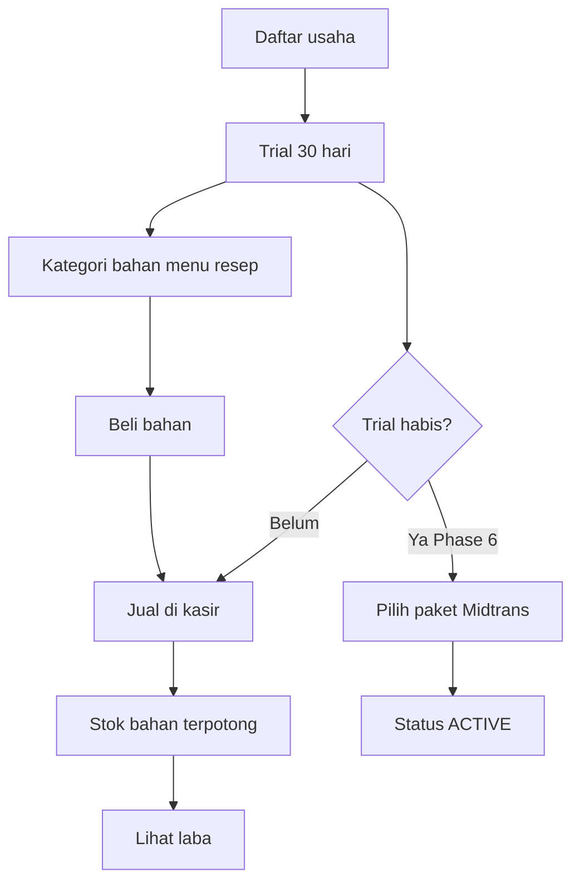
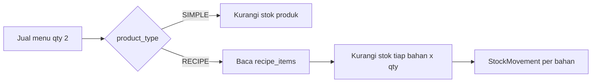
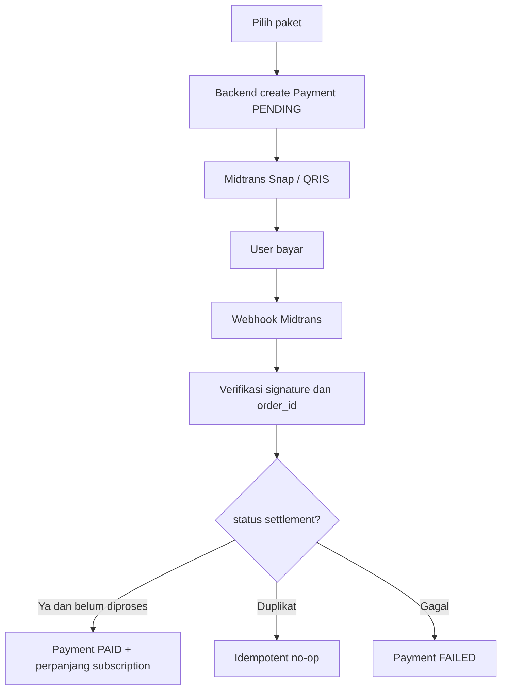
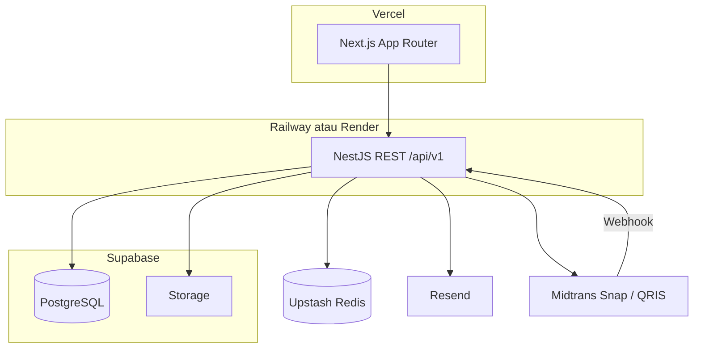

# PRD Kranjang

**Produk:** Kranjang — SaaS pencatatan usaha dan kasir (POS)  
**Tagline:** Kasir dan catatan laba untuk warung serta rumah makan  
**Versi:** 1.1  
**Tanggal:** 18 Agustus 2026  
**Status:** Phase 1 — disetujui untuk didokumentasikan  
**Lokasi repo:** `D:\Project\Freelance\SaaS\Kranjang`  
**Bahasa produk:** Indonesia  
**Mata uang:** IDR (Rupiah)  
**Timezone default:** `Asia/Jakarta`

Lampiran skema: [erd.md](./erd.md)

---

## 1. Ringkasan eksekutif

Kranjang adalah aplikasi **SaaS multi-tenant** untuk rumah makan, warung, kedai, toko, dan UMKM. Satu aplikasi dipakai banyak pemilik usaha; setiap tenant hanya melihat dan mengelola datanya sendiri.

Tujuan MVP: pemilik rumah makan dapat **jualan di kasir, stok bahan baku terpotong otomatis dari resep, lalu melihat keuntungan** tanpa spreadsheet.

### Keputusan yang dikunci

| Keputusan | Pilihan |
| --- | --- |
| Stack tanpa VPS | Next.js + NestJS + Supabase PostgreSQL + Supabase Storage + Upstash Redis + Midtrans |
| Database | Supabase (PostgreSQL hosted), bukan server sendiri |
| Auth | JWT di NestJS + RBAC, **bukan** Supabase Auth |
| Model produk | `SIMPLE` + `RECIPE`/`INGREDIENT` (BOM) |
| Outlet MVP | 1 outlet per tenant; kolom `outlet_id` tetap ada |
| Isolasi data | Shared schema, `tenant_id` dari token, tidak dari body frontend |
| HPP | Moving average, di-snapshot ke baris penjualan |
| Pajak penjualan | Disimpan terpisah; dimasukkan ke revenue di MVP |
| Stok minus | Default **blokir**; bisa dibuka di pengaturan tenant |

---

## 2. Masalah, tujuan, dan bukan tujuan

### Masalah

Pemilik rumah makan sering mencatat penjualan di nota atau chat, stok bahan tidak terhubung ke penjualan, dan keuntungan dihitung kira-kira di akhir bulan.

### Tujuan produk

1. Mencatat penjualan cepat di kasir (cari menu, barcode, kategori).
2. Mencatat bahan baku, resep menu, pembelian, dan histori stok.
3. Menghitung HPP, laba kotor, biaya operasional, dan laba bersih dengan rumus yang sama di dashboard dan laporan.
4. Memberi dashboard dan laporan yang mudah dipahami pemilik UMKM.
5. Menjadi bisnis SaaS: trial 30 hari, lalu berlangganan via Midtrans/QRIS.

### Bukan tujuan MVP

Akuntansi lengkap (jurnal, neraca), pemesanan online, meja/dine-in, KDS, aplikasi native, marketplace, loyalty, split payment, multi-outlet aktif, VPS sendiri.

---

## 3. Pengguna

| Persona | Kebutuhan utama |
| --- | --- |
| Owner | Daftar usaha, lihat laba, kelola karyawan, kelola langganan |
| Administrator | Setup master data, user, pengaturan outlet |
| Manager | Laporan, harga, pantau stok menipis |
| Cashier | Buka sesi kasir, transaksi, struk |
| Inventory Staff | Pembelian, adjustment stok, resep |
| Super Admin Kranjang | Tenant, paket, payment, suspend (Phase 7) |

---

## 4. Prinsip MVP

1. Loop rumah makan harus selesai: daftar → bahan & resep → beli stok → jualan → lihat laba.
2. Jangan menambah fitur di luar loop itu.
3. Isolasi tenant berlaku sejak hari pertama.
4. Setiap angka keuangan punya sumber kolom yang jelas (bagian 11).
5. Status pembayaran langganan hanya berubah setelah verifikasi backend/webhook.
6. Tanpa VPS: semua layanan cloud.

---

## 5. Ruang lingkup

### 5.1 Masuk MVP operasional rumah makan (Phase 2–5)

- Registrasi tenant + user Owner + outlet default + trial 30 hari (data tersimpan; enforcement penuh Phase 6)
- Login, logout, profil, ganti password
- Email verification dan reset password (dev: log tautan; production: Resend)
- RBAC: Owner, Administrator, Manager, Cashier, Inventory Staff
- Kategori, produk SIMPLE, INGREDIENT, RECIPE, satuan, foto
- BOM + HPP menu dari resep
- Inventory + stock movement
- Supplier + pembelian (stok bertambah saat diterima)
- POS: search, kategori, barcode, cart, qty, diskon, pajak, pelanggan opsional, 1 metode bayar, preview struk
- Sesi kasir buka/tutup
- Biaya operasional
- Dashboard + filter tanggal
- Laporan: penjualan, pembelian, inventory, laba-rugi, profitabilitas produk
- Export Excel/PDF untuk laporan di atas

### 5.2 Masuk skema sekarang, fitur belakangan

- `outlet_id` di data bisnis
- Tabel `subscription_plans`, `subscriptions`, `payments`
- Soft delete master data
- Audit log (aksi krusial Phase 2; lengkap Phase 7–8)

### 5.3 Keluar dari MVP

- Multi-outlet UI, transfer stok antar outlet
- Varian kompleks (ukuran/level) — MVP: Nasi Goreng Regular dan Jumbo = 2 produk
- Split payment, hold bill, meja, printer thermal native
- Waste % otomatis di resep
- Tabel konversi satuan penuh — resep memakai satuan stok bahan
- Super Admin UI (Phase 7)
- Midtrans live (Phase 6)
- Self-hosted Postgres/Redis/MinIO/Docker sebagai syarat jalan

---

## 6. Metrik keberhasilan MVP

1. Owner menyelesaikan transaksi kasir pertama dalam kurang dari 10 menit setelah menu/resep terisi.
2. Penjualan RECIPE qty N memotong semua bahan sesuai BOM × N, masing-masing ada `stock_movement`.
3. Dashboard dan P&L menampilkan Revenue, HPP, Gross Profit, Expense, Net Profit dari rumus yang sama.
4. Tenant A tidak bisa membaca data Tenant B di semua endpoint.
5. Role Cashier tidak bisa hapus produk dan tidak bisa kelola subscription.

---

## 7. User flow

### 7.1 Lifecycle tenant



### 7.2 Registrasi

1. User mengisi nama usaha, nama pemilik, email, password, nomor HP.
2. Sistem membuat Tenant, User Owner, Role Owner, Outlet default, `trial_start_date` = sekarang, `trial_end_date` = +30 hari, `subscription_status` = `TRIAL`.
3. Email verifikasi dikirim.
4. Onboarding: kategori → bahan → menu → resep.

### 7.3 POS

1. Kasir membuka sesi (modal awal opsional).
2. Cari / barcode / kategori → keranjang → qty / diskon.
3. Pilih satu metode bayar.
4. Backend menyimpan dalam **satu transaksi database**: sale, sale_item, sale_payment, HPP snapshot, potong stok, stock_movement.
5. Preview/cetak struk (browser print).

### 7.4 Potong stok RECIPE



Contoh: Nasi Goreng × 2, resep 1 porsi = beras 0,15 kg + telur 1 + minyak 0,02 L.  
Beras −0,30 kg, telur −2, minyak −0,04 L. Stok menu RECIPE tidak dilacak.

### 7.5 Subscription (Phase 6)



Frontend **tidak** boleh mengubah status langganan.

---

## 8. Use case

| ID | Aktor | Use case | Phase |
| --- | --- | --- | --- |
| UC-01 | Owner | Daftar tenant, dapat trial 30 hari | 2 |
| UC-02 | Semua | Login / logout sesuai role | 2 |
| UC-03 | Admin | CRUD kategori dan produk SIMPLE | 3 |
| UC-04 | Inventory / Admin | CRUD bahan dan resep BOM | 3 |
| UC-05 | Sistem | Hitung HPP menu dari moving average bahan | 3–4 |
| UC-06 | Inventory | Pembelian supplier; stok bertambah saat received | 3 |
| UC-07 | Kasir | Transaksi POS + struk | 4 |
| UC-08 | Owner / Admin | Catat biaya operasional | 5 |
| UC-09 | Owner / Manager | Dashboard filter tanggal | 5 |
| UC-10 | Owner / Manager | Laporan P&L dan profitabilitas produk + export | 5 |
| UC-11 | Owner | Kelola user karyawan | 2 |
| UC-12 | Sistem / Kasir | Blokir jual jika stok kurang (default) | 4 |
| UC-13 | Owner | Ganti password, profil | 2 |
| UC-14 | Owner | Forgot / reset password, verifikasi email | 2 |
| UC-15 | Inventory | Adjustment stok + waste | 3 |
| UC-16 | Kasir | Buka / tutup sesi kasir | 4 |
| UC-17 | Owner | Batal penjualan (cancel) + stok balik | 4 |
| UC-18 | Owner | Pilih paket dan bayar Midtrans | 6 |
| UC-19 | Sistem | Webhook, grace period, expired read-only | 6 |
| UC-20 | Super Admin | Lihat tenant, suspend, kelola paket | 7 |

---

## 9. Kebutuhan fungsional

### 9.1 Tenant, trial, subscription

Field tenant: `trial_start_date`, `trial_end_date`, `subscription_status`, `subscription_plan_id`, `payment_status`.

Status: `TRIAL` | `ACTIVE` | `GRACE_PERIOD` | `EXPIRED` | `SUSPENDED` | `CANCELLED`.

Perilaku setelah expired (Phase 6):

- Login tetap boleh
- Data penting read-only
- Transaksi baru, pembelian, adjustment, create master ditolak
- UI mengarahkan perpanjangan

Paket **tidak hard-code**. Seed:

| Kode | Nama | Harga / bulan | Durasi |
| --- | --- | --- | --- |
| trial | Free Trial | Rp0 | 30 hari |
| basic | Basic | Rp49.000 | 1 bulan |
| business | Business | Rp99.000 | 1 bulan |
| pro | Pro | Rp199.000 | 1 bulan |

Setiap paket punya limit: jumlah user, produk, transaksi/bulan, outlet, storage; flag: laporan, inventory, multi-outlet, export.

Billing Phase 6: monthly, annual, renewal, expiration, grace period (default 3 hari), payment history, invoice, upgrade (prorate), downgrade (berlaku periode berikutnya), cancel.

### 9.2 Auth dan RBAC

Fitur: register, login, logout, forgot/reset password, email verification, profil, ganti password, role, permission.

Permission awal:

- `product.view|create|update|delete`
- `recipe.manage`
- `sales.view|create|cancel`
- `purchase.view|create|receive`
- `inventory.view|adjust`
- `expense.view|create|update|delete`
- `report.view`
- `user.manage`
- `subscription.manage`
- `settings.manage`

Mapping default:

| Role | Inti izin |
| --- | --- |
| Owner | Semua |
| Administrator | Semua kecuali subscription.manage (opsional: Owner saja) |
| Manager | view hampir semua, update harga/produk, report.view, tanpa user.manage |
| Cashier | sales.view/create, product.view, cashier session |
| Inventory Staff | product/recipe/purchase/inventory, tanpa sales.create |

Employee tidak punya tabel terpisah di MVP. Karyawan = `User` + role.

### 9.3 Produk dan resep

Field produk: SKU, barcode, nama, kategori, satuan, harga beli, harga jual, min stock, stock, aktif, foto, supplier default, `product_type`.

`product_type`:

- `INGREDIENT` — dilacak stok, biasa dibeli, dipakai di resep
- `SIMPLE` — dilacak stok, dijual apa adanya (air botol)
- `RECIPE` — dijual sebagai menu, stok tidak dilacak, HPP dari BOM

BOM (`recipe_items`): `product_id` (menu RECIPE), `ingredient_id`, `quantity`, `unit`.

Validasi:

- Bahan tidak merujuk dirinya sendiri
- `ingredient_id` harus `INGREDIENT` atau `SIMPLE`
- Satuan resep = satuan stok bahan
- RECIPE wajib punya minimal 1 bahan sebelum bisa dijual

HPP menu = Σ (`qty_resep × avg_cost_bahan`).

### 9.4 Inventory

Setiap perubahan stok wajib `stock_movements`: tanggal, produk, qty, stock_before, stock_after, type, reference_type, reference_id, user.

Tipe MVP: `PURCHASE`, `SALE`, `ADJUSTMENT`, `INITIAL_STOCK`, `WASTE`.  
Ditunda: `SALE_RETURN`, `PURCHASE_RETURN`, `STOCK_TRANSFER`.

### 9.5 Pembelian

Header: supplier, nomor invoice, tanggal, diskon, pajak, total, status bayar (`UNPAID` / `PARTIAL` / `PAID`), status dokumen (`DRAFT` / `RECEIVED` / `CANCELLED`).

Saat `RECEIVED`: stok bertambah, movement `PURCHASE`, update moving average.

### 9.6 POS / penjualan

Wajib: search, barcode, filter kategori, cart, qty, diskon baris dan header, pajak, customer opsional, satu metode (`CASH`, `QRIS`, `TRANSFER`, `EWALLET`, `CARD`), preview struk.

Tidak di MVP: split payment, hold bill, meja.

Status sale: `COMPLETED` | `CANCELLED`. Cancel mengembalikan stok + movement balik.

### 9.7 Biaya operasional

Kategori seed: listrik, air, internet, sewa, gaji, transportasi, maintenance, marketing, lainnya.

Field: category, description, amount, date, payment method, attachment opsional, created_by.

Pembelian barang **bukan** expense. Waste boleh dicatat sebagai movement `WASTE` (mengurangi persediaan); tidak otomatis jadi expense kecuali user mencatat manual.

### 9.8 Dashboard dan laporan

Filter: hari ini, minggu ini, bulan ini, tahun ini, custom range. Minggu dimulai Senin.

Kartu dashboard: penjualan hari ini, penjualan bulan ini, jumlah transaksi, produk terlaris, stok menipis (bahan/SIMPLE), gross profit, net profit, expense, grafik penjualan, grafik keuntungan, perbandingan periode sebelumnya.

Laporan MVP:

1. Sales — transaksi, produk, qty, omzet, diskon, metode bayar
2. Purchase — supplier, produk, qty, total
3. Inventory — stok, movement, valuation, low stock
4. Profit & Loss — revenue, HPP, gross profit, expense, net profit
5. Product Profitability — qty terjual, revenue, HPP, profit, margin %
6. Cash Flow (sederhana) — uang masuk dari `sale_payments` vs pengeluaran expense + pembelian yang sudah dibayar (bukan akrual penuh)

Export Excel dan PDF.

### 9.9 Super Admin (Phase 7)

Melihat: jumlah tenant, aktif, trial, expired, jumlah user, jumlah transaksi bisnis, revenue subscription, payment success/failed.

Aksi: CRUD paket, lihat tenant, suspend/activate, lihat payment/subscription, lihat audit log.

---

## 10. Non-fungsional

| Aspek | Target MVP |
| --- | --- |
| POS simpan transaksi | P95 < 1,5 detik pada data 1 outlet, 500 produk |
| Bahasa / format | ID, `Rp 10.000`, tanggal `18/08/2026` |
| Responsive | Mobile + tablet kasir |
| Ketersediaan | Layanan cloud; tidak ada SLA ketat di MVP |
| Backup | Point-in-time / backup Supabase |
| Observability | Log API + audit log; APM Phase 8 |

---

## 11. Perhitungan keuangan

Filter tanggal sama, timezone `Asia/Jakarta`, hanya `sales.status = COMPLETED`.

| Metrik | Sumber |
| --- | --- |
| Revenue | `SUM(sales.total_net)` — setelah diskon, **termasuk pajak** |
| HPP / COGS | `SUM(sale_items.cogs_amount)` yang di-snapshot saat transaksi |
| Gross Profit | Revenue − HPP |
| Expense | `SUM(expenses.amount)` pada rentang tanggal |
| Net Profit | Gross Profit − Expense |
| Nilai persediaan | `SUM(stock × avg_cost)` untuk `INGREDIENT` dan `SIMPLE` |

HPP per baris:

- SIMPLE: `qty × avg_cost` produk itu
- RECIPE: `qty_menu × Σ(qty_bahan_resep × avg_cost_bahan)`

Moving average saat pembelian diterima:

`new_avg = (qty_lama × avg_lama + qty_beli × harga_beli) / (qty_lama + qty_beli)`

Pembelian stok **tidak** masuk Net Profit (itu aset). Waste mengurangi stok; COGS muncul saat barang terjual, atau nilai hilang tercatat di laporan inventory waste (bukan otomatis expense).

---

## 12. Arsitektur



Lapisan: Frontend, Backend API, Database, Payment, File Storage, Authentication, Subscription Service, Notification.

Aturan:

- Business logic penting hanya di NestJS
- `tenantId` dari JWT
- Prisma selalu filter `tenant_id`
- RLS Supabase opsional sebagai lapisan kedua, bukan pengganti
- Webhook Midtrans ke URL publik NestJS, bukan ke Vercel

Kenapa PostgreSQL (Supabase), bukan Mongo/Firebase: transaksi atomik kasir, foreign key, agregasi laporan.

---

## 13. Teknologi

| Bagian | Pilihan |
| --- | --- |
| Frontend | Next.js App Router, TypeScript, Tailwind, shadcn/ui, Vercel |
| Backend | NestJS, TypeScript, Railway atau Render |
| ORM | Prisma, `postgresql`, koneksi pooler Supabase |
| Database | Supabase PostgreSQL |
| Storage | Supabase Storage |
| Redis | Upstash — opsional Phase 2–5, wajib job billing Phase 6 |
| Auth | JWT access pendek + refresh httpOnly |
| Payment | Midtrans Snap; QRIS sebagai channel |
| Email | Resend |
| Validasi | class-validator / Zod |
| Tes | Jest API, Playwright POS smoke |

Tidak dipilih: Neon (setelah user pilih Supabase), MongoDB Atlas, Firebase, SQLite sebagai DB produksi.

---

## 14. Data

Lihat [erd.md](./erd.md) untuk kolom, index, dan relasi lengkap.

Entity: Tenant, User, Role, Permission, Subscription, SubscriptionPlan, Payment, Product, Category, Supplier, Purchase, PurchaseItem, Sale, SaleItem, Expense, StockMovement, Customer, Outlet, CashierSession, AuditLog, RecipeItem.

Aturan umum:

- PK UUID
- `created_at`, `updated_at`
- Soft delete: product, category, customer, supplier, user
- `tenant_id` di seluruh tabel bisnis
- Unique SKU/barcode **per tenant**
- Sale tidak dihapus keras; hanya `CANCELLED`

---

## 15. API — kontrak arah

Prefix `/api/v1`. Error seragam:

```json
{
  "code": "STOCK_INSUFFICIENT",
  "message": "Stok beras tidak cukup",
  "details": { "productId": "...", "available": 0.1, "required": 0.3 }
}
```

Resource milik tenant lain: **404**, bukan 403.

### Auth

| Method | Path |
| --- | --- |
| POST | `/auth/register` |
| POST | `/auth/login` |
| POST | `/auth/logout` |
| POST | `/auth/forgot-password` |
| POST | `/auth/reset-password` |
| POST | `/auth/verify-email` |
| POST | `/auth/refresh` |
| GET/PATCH | `/me` |
| POST | `/me/change-password` |

Register request:

```json
{
  "businessName": "Warung Nasi Goreng Pak Budi",
  "ownerName": "Budi",
  "email": "budi@example.com",
  "password": "********",
  "phone": "081234567890"
}
```

Login response (bentuk):

```json
{
  "user": { "id": "...", "name": "Budi", "role": "OWNER" },
  "tenant": { "id": "...", "name": "Warung Nasi Goreng Pak Budi", "subscriptionStatus": "TRIAL" }
}
```

Access token di JSON atau memory; refresh token httpOnly cookie.

### Master & operasi

| Method | Path |
| --- | --- |
| CRUD | `/users`, `/roles` |
| CRUD | `/categories`, `/products` |
| PUT | `/products/:id/recipe` |
| CRUD | `/suppliers`, `/customers` |
| CRUD | `/purchases` |
| POST | `/purchases/:id/receive` |
| POST | `/inventory/adjust` |
| GET | `/inventory/movements` |
| POST | `/cashier-sessions/open` |
| POST | `/cashier-sessions/:id/close` |
| POST | `/sales` |
| GET | `/sales/:id` |
| POST | `/sales/:id/cancel` |
| CRUD | `/expenses` |
| GET | `/dashboard` |
| GET | `/reports/sales` |
| GET | `/reports/purchases` |
| GET | `/reports/inventory` |
| GET | `/reports/profit-loss` |
| GET | `/reports/product-profitability` |
| GET | `/reports/cash-flow` |
| GET | `/reports/:type/export?format=xlsx\|pdf` |

### Billing Phase 6

| Method | Path |
| --- | --- |
| GET | `/billing/plans` |
| GET | `/billing/subscription` |
| POST | `/billing/checkout` |
| POST | `/billing/cancel` |
| GET | `/billing/payments` |
| POST | `/webhooks/midtrans` |

Webhook tanpa JWT user; verifikasi signature Midtrans. Idempoten pada `order_id`.

### Super Admin Phase 7

Prefix `/admin`, guard Super Admin (bukan tenant bisnis).

`/admin/tenants`, `/admin/plans`, `/admin/payments`, `/admin/subscriptions`, `/admin/audit-logs`, `/admin/metrics`.

### Validasi umum

- Email unik global untuk login
- Password min 8 karakter
- Qty > 0
- Harga ≥ 0
- RECIPE tidak bisa received sebagai pembelian stok jadi
- SKU unik per tenant jika diisi
- File: jpeg/png/webp/pdf, max 2 MB (foto), 5 MB (attachment)

### Error code awal

`UNAUTHORIZED`, `FORBIDDEN`, `NOT_FOUND`, `VALIDATION_ERROR`, `STOCK_INSUFFICIENT`, `RECIPE_EMPTY`, `SUBSCRIPTION_INACTIVE`, `CONFLICT`, `PAYMENT_UNVERIFIED`, `RATE_LIMITED`

---

## 16. Keamanan

Berlaku sejak Phase 2:

- Password Argon2id (atau bcrypt cost tinggi jika Argon2 belum tersedia di runtime)
- JWT + RBAC
- Tenant dari token
- Prisma parameterized query
- Helmet, CORS allowlist Vercel origin
- Rate limit login (Upstash atau in-memory per instance di awal)
- Upload whitelist
- Tidak menyimpan data kartu
- HTTPS di production
- Webhook signature + idempotency
- Audit: login, logout, CRUD produk, adjustment, sale, cancel sale, expense, subscription, payment

---

## 17. UI/UX

Bahasa Indonesia. Format Rupiah. Tanggal Indonesia. Navigasi jelas untuk pemilik yang tidak teknis.

Sidebar: Dashboard, Kasir, Produk, Inventory, Pembelian, Penjualan, Pelanggan, Supplier, Biaya, Laporan, User & Role, Subscription, Pengaturan.

Wajib: empty state, loading, error, konfirmasi bayar / batal transaksi / adjustment stok.

POS prioritas tablet: tombol besar, cari cepat, kategori horizontal.

---

## 18. Roadmap

Setiap phase menghasilkan perangkat lunak yang bisa ditest, **hanya untuk scope phase itu**. Dokumentasi phase: arsitektur, schema, endpoint, request/response, logic, validasi, error, security, kode, tes.

| Phase | Isi | DoD |
| --- | --- | --- |
| 1 | PRD, use case, flow, arsitektur, ERD | Dokumen ini + erd.md |
| 2 | Auth, multi-tenancy, user & role | Register/login, isolasi tenant, RBAC tes |
| 3 | Produk, kategori, BOM, inventory, supplier, purchase | Beli bahan → stok naik + movement |
| 4 | POS, sales, bayar, potong stok SIMPLE+RECIPE | Jual menu → bahan turun + HPP snapshot |
| 5 | Expense, P&L, dashboard, report, export | Angka dashboard = P&L |
| 6 | Trial enforcement, Midtrans, QRIS, webhook | Expired read-only; bayar → ACTIVE |
| 7 | Super Admin | Suspend tenant, CRUD paket |
| 8 | Hardening, tes beban, Vercel+Railway, backup | Checklist security + deploy |

Kode aplikasi **belum** ditulis sampai Phase 2 diminta.

---

## 19. Risiko

| Risiko | Mitigasi |
| --- | --- |
| Satuan resep salah | UI menampilkan satuan stok; tidak ada konversi tersembunyi |
| Stok kurang | Default blokir |
| HPP berubah setelah beli baru | Snapshot `cogs_amount` di `sale_items` |
| Webhook dobel | Unique `order_id` + state machine payment |
| Scope creep | Tolak sampai Phase 5 selesai |
| Limit free Supabase | Pooler Prisma; kompres foto; upgrade saat ada tenant bayar |
| NestJS tidak di Vercel | API di Railway/Render; webhook ke API |

---

## 20. Asumsi

1. 1 usaha = 1 tenant = 1 outlet di MVP.
2. Menu RECIPE tidak punya stok jadi.
3. Pajak penjualan termasuk revenue.
4. Tidak ada VPS.
5. Printer = browser print.
6. Karyawan yang tidak login tidak dicatat di sistem (boleh masuk expense gaji).
7. QRIS di POS adalah metode pencatatan (kasir menandai sudah bayar QRIS), bukan settlement Midtrans per struk di MVP. Midtrans dipakai untuk **langganan SaaS**.

---

## 21. Deliverable Phase 1

- [Kranjang-prd.md](./Kranjang-prd.md) — dokumen ini
- [erd.md](./erd.md) — ERD dan kamus data

Phase 2 dimulai hanya jika diminta.
